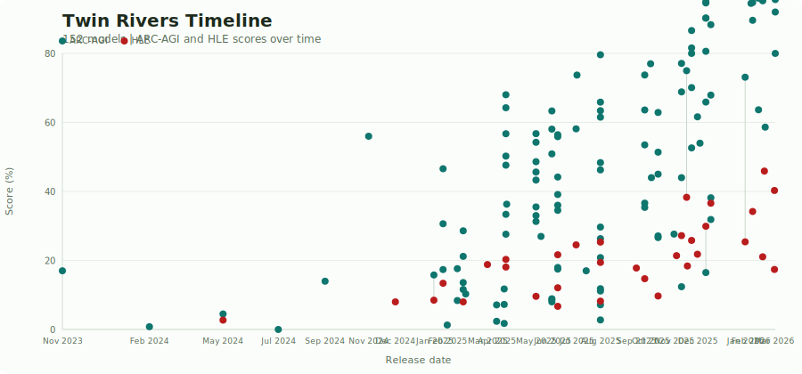
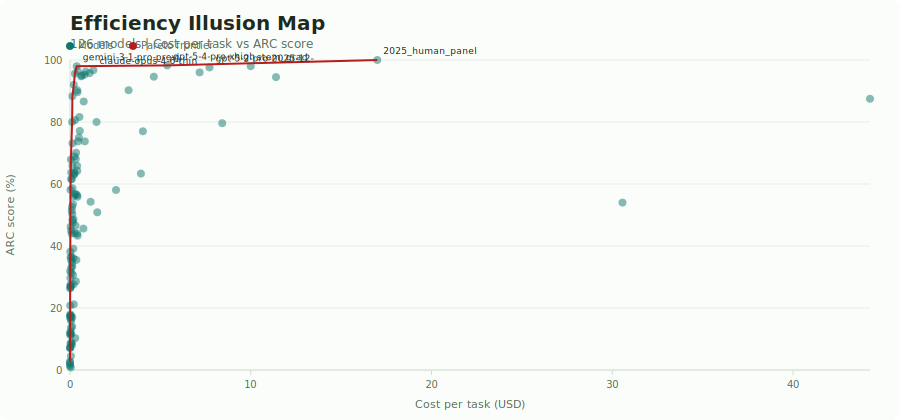
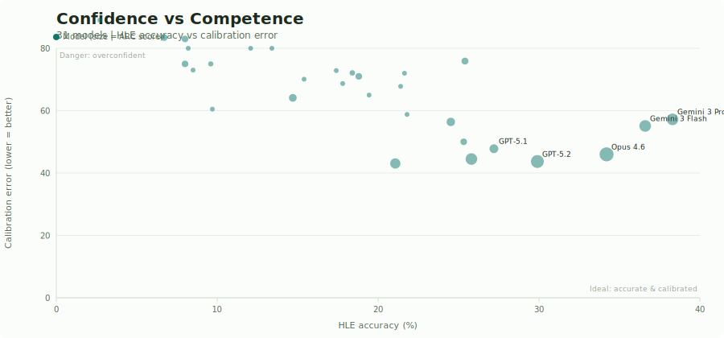
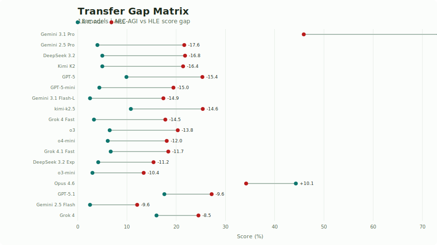

# AGI Gap Atlas

Narrative-first benchmark observatory comparing ARC-AGI and Humanity's Last Exam across multiple capability dimensions.

**Core thesis:** Capability is rising fast, but efficiency, calibration, and domain robustness are NOT rising equally.

## Charts

### Twin Rivers Timeline

How progress differs across ARC-AGI and HLE over release time.



### Efficiency Illusion Map

Do higher ARC scores come from smarter models, higher cost, or both?



### Confidence vs Competence

A model is safer when it is accurate and well-calibrated.



### Transfer Gap Matrix

How much does ARC-AGI score differ from HLE score for the same model?



## Live interactive

https://mathias3.github.io/BenchmarkAtlas/

The interactive version has tooltips, legends, and hover details for every data point.

## Run locally

1. Run pipeline:

```bash
python -m pipeline.run_pipeline
```

2. Serve static site:

```bash
python -m http.server 8000
```

3. Open: `http://localhost:8000/site/`

## Data sources

- ARC evaluations: `https://arcprize.org/media/data/leaderboard/evaluations.json`
- ARC models: `https://arcprize.org/media/data/models.json`
- HLE models API: `https://dashboard.safe.ai/api/models`

## Notes

- If network fetch fails, cached files under `data/sources/` are used.
- Model matching across ARC/HLE is handled via `data/model_aliases.json`.
- Phase 2 (subject-level HLE blind spots) deferred until local eval data is available.
